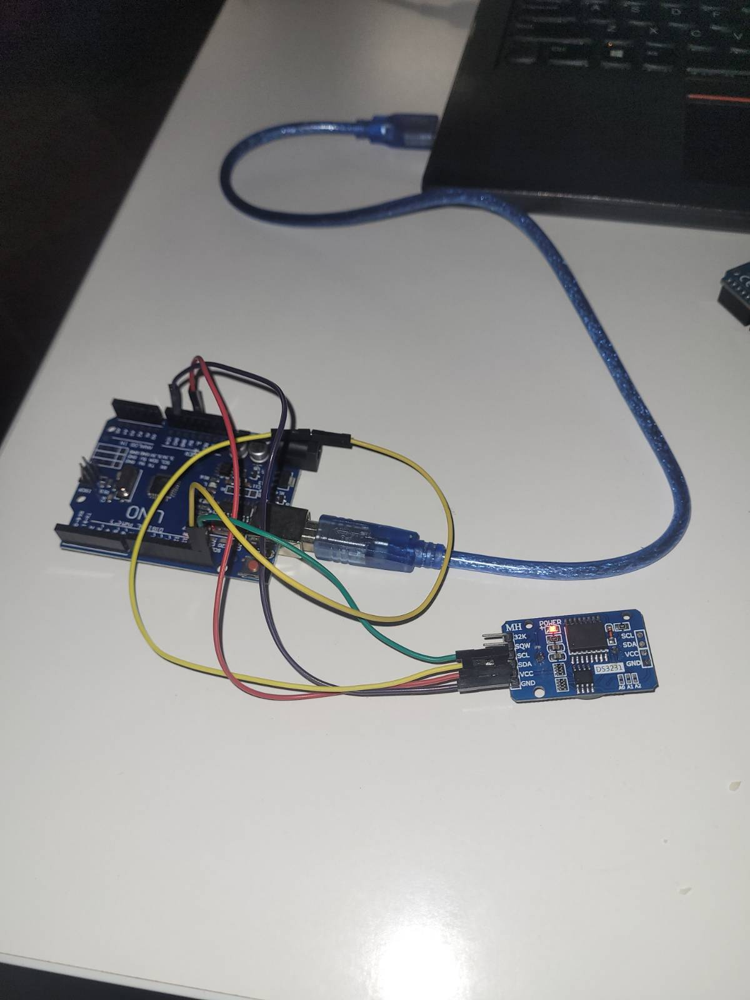

# The Hackerspace TOTP door lock

### !!! QUARTERLY MAINTENANCE

Take lock apart, connect like in the picture below and do:

`sudo make uno-configure-ds3231`



If you have problems, check out `sync_clock` branch. It's a mess, but worked.

### Description
The TOTP-lock is based on Arduino Pro Mini Atmega328 - 5V 16MHz. The parts connected to the microcontroller are: 
 - [the relay](https://allegro.pl/oferta/modul-1-kanalowy-przekaznik-5v-10a-7953863748), which opens the electric strike ([PIN 12](https://github.com/hakierspejs/hsldz_totp_lock/blob/main/hsldz_totp_lock/hsldz_totp_lock.ino#L11)) 
 - [the pin pad 4x4](https://allegro.pl/oferta/klawiatura-membranowa-numeryczna-4x4-arduino-9611679849), which allows to input TOTP-codes ([PINs 2-8](https://github.com/hakierspejs/hsldz_totp_lock/blob/main/hsldz_totp_lock/hsldz_totp_lock.ino#L35))
 - the buzzer, to signal about wrong/correct input ([PIN 10](https://github.com/hakierspejs/hsldz_totp_lock/blob/main/hsldz_totp_lock/hsldz_totp_lock.ino#L10))
 - the button to open the door from the inside  ([PIN 13](https://github.com/hakierspejs/hsldz_totp_lock/blob/main/hsldz_totp_lock/hsldz_totp_lock.ino#L12))
 
The open-button is connected via a [software debouncer](https://github.com/hakierspejs/hsldz_totp_lock/blob/aedc9e4bd50019f3f2bc459a3ce09191bc713dde/hsldz_totp_lock.ino#L113) and hardware low-pass filter with a pull-up resistor:

It's necessary to avoid spontaneous door opening because of an electromagnetic noise (for instance, when fluorescent lamps turn on)


There is also a [DC-DC converter 12V->5V](https://www.aphelektra.com/regulatory-napiecia/6033-modul-przetwornicy-step-down-mp2307-1v-17v-18a.html). 

### Known issues:
 - spontaneous door opening  because of an electromagnetic noise  (solved with software debouncer and LP-filter)
 - spontaneous PinPad presses because of an electromagnetic noise (may be solved by cable with a concentric conducting shield)
 - RTC desynchronization (solved with DS3231)


### Running locally
To run it locally it's a good idea to use an Arduino Uno board. You need to connect a DS3231 RTC, a pin pad, and a buzzer, as a minimum.  
At first, it's necessary to configure DS3231, you may use the next commands: 
```
make generate-example-secrets
make uno-configure-ds3231 DEVICE_SERIAL=/dev/ttyACM0
```
What generates random secrets, sets RTC time, and writes example secrets to DS3231 EEPROM.

Now you are able to upload the TOTP-lock sketch: 
```
make uno-upload-lock DEVICE_SERIAL=/dev/ttyACM0
```
There is also the ability to print out QR-code in your console:
```
make show-qr-code KEY_NUM=1
```
To generate TOTP-code directly, without any additional app, use: 
```
make show-totp-code KEY_NUM=1
```
You may want to connect to the board via serial interface, for debugging purposes: 
```
make serial-read DEVICE_SERIAL=/dev/ttyACM0
```

### Maintenance
There are two maintenance commands, which allow checking the current UNIX timestamp and disabling the necessary door key. Each of them is available only for the maintenance key (key 0).
To check a current DS3231 timestamp enter:
```
*0000000000[6-digits TOTP code]#
``` 
As a result, the DS3231 UNIX-timestamp will be played in reverse order [(morse encoding)](https://en.wikipedia.org/wiki/Morse_code).

To disable the door key (for instance key 7):
```
*0001070700[6-digits TOTP code]#
```

### Debugging 
* disconnect 12v cable from the TOTP-lock 
* disconnect the pin pad Rj-45 
* disconnect the electric strike cable 

**Now you can remove (unhook) the TOTP-lock case from the door**
* disconnect the voltage converter from the Arduino board  
* disconnect the relay from the Arduino board if you are not going to debug it
* connect to the microcontroller via Serial USB-TTL adapter from your laptop

Now you able to upload the sketch via Arduino IDE and see the output in the serial monitor.
By default, every time the lock opens microcontroller [prints out the Unix timestamp from the RTC to the serial interface](https://github.com/hakierspejs/hsldz_totp_lock/blob/aedc9e4bd50019f3f2bc459a3ce09191bc713dde/hsldz_totp_lock.ino#L9).
  

### QR-codes distribution
There is an ability to generate QR-code of the necessary secret. 
``` 
make decrypt
make gen-qr-code KEY_NUM=3
``` 
You may share the QR-code-HTML in any eligible way.


### Other

To view one QR-code:
```
make decrypt
make show-qr-code KEY_NUM=3
```

-----------------------------
Feel free to contribute
